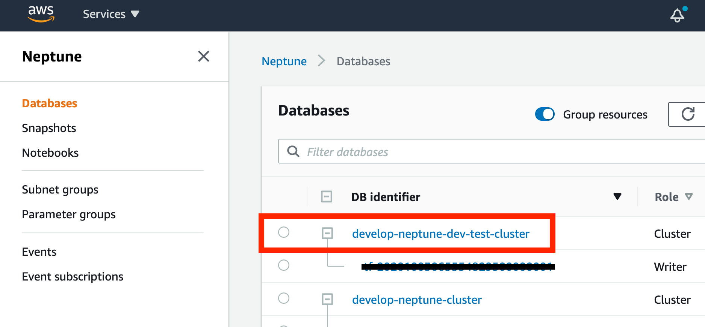
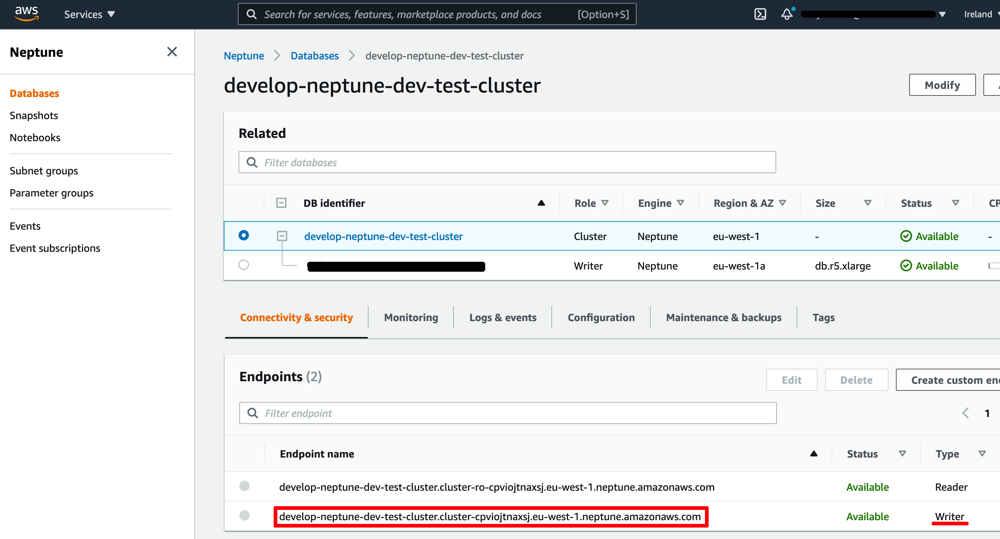

Migrating from Neo4j to AWS Neptune
=======================

A developer guide for moving the CMD services from using Neo4j to AWS Neptune.

### Introduction to Neptune

- Neptune is a graph database that is provided as a managed AWS service. This saves a lot of the operational overhead we had with Neo4j, and provides clustering capabilities out of the box.
- Neptune supports both Gremlin and SPARQL as graph query languages. Our implementation is using Gremlin.
- A Neptune cluster has a primary instance for read and write operations, and up to 15 read replica instances. When connecting to Neptune, the cluster endpoint will connect to the primary instance. There is also a reader endpoint which will connect to one of the available read only instances.
- Neptune mostly complies with Gremlin standards but there are some caveats. This is the reason we cannot simply run another Gremlin compliant graph database locally. [See here](https://docs.aws.amazon.com/neptune/latest/userguide/feature-overview-standards-compliance.html) for more details on the standard compliance.
- For more information on Neptune refer to the [Neptune docs](https://docs.aws.amazon.com/neptune/latest/userguide/intro.html)

### Local development - How do I run the CMD services against Neptune?

Neo4j runs within a docker container as part of the [dp-compose](https://github.com/ONSdigital/dp-compose) project. Running a local instance of Neptune is not possible, so we must use a test instance hosted in AWS. AWS Neptune instances are private to the VPC, so an SSH tunnel must be used for access.

#### Use SSH port forwarding to connect to a Neptune cluster

First you need the address of the cluster you want to connect to. You can get this from the AWS console:

1. Go to the Neptune section of the AWS console https://eu-west-1.console.aws.amazon.com/neptune
1. Select Databases from the side menu (it may already be selected)
1. Click on the link for the cluster you want to connect to. For local development, the `develop-neptune-dev-test-cluster` should be used.

    

1. The cluster address can now be copied from the 'Connectivity & security' section at the bottom

    

1. Run the command to port forward to the Neptune cluster, where `{cluster address}` is replaced with the `develop-neptune-dev-test-cluster` cluster endpoint address.

#### Using the DP CLI:
 ```
 dp ssh develop publishing 1 -p 8182:{cluster address}:8182
 ```

#### If not using the DP CLI:

For example:

```shell
dp ssh develop publishing 1 -p 8182:develop-neptune-dev-test-cluster.cluster-cpviojtnaxsj.eu-west-1.neptune.amazonaws.com:8182
```

#### If not using the DP CLI:

In the terminal, CD into the ansible directory of the dp-setup project:

```shell
cd dp-setup/ansible
```

Run the SSH command with port forwarding:

```shell
ssh -F ssh.cfg -L 8182:{cluster address}:8182 {user name}@{publishing asg node IP}
```

#### Configure a custom hostname to connect to Neptune

Neptune requires a secure connection. The SSL certificate provided by Neptune requires hosts to match it's configured wildcards. This does not include localhost, so a custom hostname has to be used.

On your MacBook add a host to the 127.0.0.1 entry in `/etc/hosts`, using the suffix of the Neptune host.

For example, a custom host using a prefix of `localhost` and a suffix of the `dev-test` Neptune cluster host:

```text
127.0.0.1	localhost localhost.cluster-cpviojtnaxsj.eu-west-1.neptune.amazonaws.com
```

More information can be found here: https://docs.aws.amazon.com/neptune/latest/userguide/security-ssl.html

#### Configure the required CMD services to use Neptune

Each service using the graph database does do via the [dp-graph](https://github.com/ONSdigital/dp-graph/) library. This library provides an abstraction over the graph database, and handles the configuration for which graph database provider to use. The default values when running locally are set to use Neo4j. 

To use Neptune, ensure you have the following environment variables set:

```shell
export GRAPH_DRIVER_TYPE=neptune
export GRAPH_ADDR=wss://{{host}}:8182/gremlin
```

where host is the same as the custom host used in the previous section. An example using the example host:

```shell
export GRAPH_DRIVER_TYPE=neptune
export GRAPH_ADDR=wss://localhost.cluster-cpviojtnaxsj.eu-west-1.neptune.amazonaws.com:8182/gremlin
```

Most likely you will set the environment variables globally in your profile, however if you do want to configure each service individually you will need the environment variables available to the following services:

- dp-dataset-api
- dp-filter-api
- dp-code-list-api
- dp-dimension-importer
- dp-dataset-exporter
- dp-hierarchy-api
- dp-hierarchy-builder
- dp-import-tracker
- dp-observation-importer
- dp-observation-api

### Gremlin Console

The Gremlin console is a command line application that allows ad-hoc queries to be run against Neptune.

For installation instructions, see the [getting started guide](https://tinkerpop.apache.org/docs/3.4.8/tutorials/getting-started/)

Once the console is running, and your port forwarding is set up, you need to run the following command in the Gremlin Console (**including the colon at the start of the line**):

```text
:remote connect tinkerpop.server conf/remote-secure.yaml
```

This command connects the console to the server defined in the `conf/remote.yaml` configuration file, which is localhost (using the port forwarding)

Once connected you run another command to tell the console to send the commands to the remote server:

```text
:remote console
```

For further details on writing Gremlin queries, refer to the [Gremlin reference](https://tinkerpop.apache.org/docs/current/reference/)

### CMD Data Import

The CMD import process requires specific data to be in place before a dataset can be imported. The list below contains each of the types required, along with a link to the repository where more information about importing the data can be found.

- [recipes](https://github.com/ONSdigital/dp-recipe-api) - stored in your local mongo DB instance, so will need to be loaded if you haven't already
- [code lists](https://github.com/ONSdigital/dp-code-list-scripts) - these are stored in the graph DB, so most likely they will already be loaded
- [hierarchies](https://github.com/ONSdigital/dp-hierarchy-builder) - these are stored in the graph DB, so most likely they will already be loaded

For further details on the CMD import process, see the [CMD import guide](GETTING_STARTED.md#cmd-import-steps)
