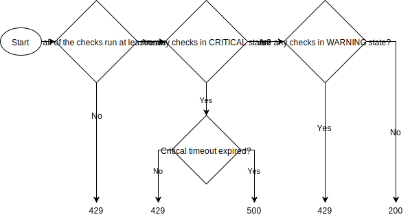

Health check specification
==========================

All apps that run in production are required to have a health check.  The health check must comply with this spec and have an HTTP [health endpoint](#health-endpoint) to return the health status, even if they are event-driven.  The main function of the health check is to enable the app to signal to the platform whether or not it is functional by means of the [status code](#health-endpoint-status-codes).  The platform will then use this information to manage routing to the app and the lifecycle of the app.  A secondary purpose of the health check is to assist a human in rapid debugging of issues by utilising the details returned in the body.

A health check is comprised of two components:

1. [The checks](#checks): Specific tests (can be external or internal) that are triggered on a fixed interval to ascertain the current health status.  A health check may run many checks.
2. [The health endpoint](#health-endpoint): The endpoint that returns information about the current health status.

Checks
------

The purpose of a health check is so that a monitoring tool can quickly determine the current fitness of that app to perform its function.  In order to determine the current health status of the app, the health check can need to run many different checks, and indeed many different types of checks.  These checks can be against external dependencies or the internal functioning of the app.

Some examples of things that can be checked are:

* the status of the connections to the data stores and other third party dependencies
* the status of other apps the app depends on
* the status of the host on which the app is running
* the status of the application logic (e.g. Kafka message processing failures, request processing failures, concurrent request thresholds, etc.)

The checks should test that the dependency is able to perform the required function. For example, if you are checking that Mongo is available you would also want to check that you are able to query the collection that your app depends on.  This can mean that multiple checks are required for the same dependency.

Each check will return a [summary of the check status](#check). The details returned are intended for a human investigating an issue. Therefore, the message returned should be specific but brief.  For example, some potential messages could be `OK`, `received status code 500`, `failed to resolve DNS`, `collection 'X' does not exist`, `index 'X' does not exist`, etc.

The following requirements must be met by health check implementations:

* The app must perform checks in order to determine its current status.
* The checks must all run all on a fixed interval that can be set per app
* The checks must have a failure threshold per check of the number of sequential failed checks before which the check is marked as a failure
* The checks must have a healthy threshold per check of the number of sequential healthy checks before which the check is marked as healthy
* Changes in [check statuses](#check-statuses) (including the overall app status) must be logged out

### Check statuses

The status of the [check](#checks) can be one of three values:

Status     | Description
-----------|--------------
`OK`       | Everything is ok
`WARNING`  | Things are degraded, but at least partially functioning
`CRITICAL` | The checked functionality is unavailable or non-functioning

Health endpoint
---------------

The current health status of the app is served via the health endpoint.  This health status comes in two forms.  The status code provides a quick way to get the overall status of the app, while the JSON body provides further information that might be useful in triaging any issues.

The following requirements must be met by health check implementations:

* All apps must have a health endpoint
* The health endpoint must be available as `GET /health`
* The health endpoint must return the [appropriate status code](#health-endpoint-status-codes)
* The health endpoint must return [status information as JSON](#health-endpoint-body)
* The health endpoint must return the start time and uptime (specifically the time since the health check was instantiated)

### Health endpoint status codes

There are three standard status codes that a health endpoint can return:

Status code | Description
------------|------------------------
`200`       | I'm fine
`429`       | I'm warming up or I'm degraded
`500`       | Kill me

The health endpoint should return 429 until the first [checks](#checks) have been run.  After that, the codes returned should be based on the [check](#checks) statuses.  It is the responsibility of whatever is monitoring the health endpoint to provide a grace period on startup.

If any [check](#checks) returns a `CRITICAL` status (see [check statuses above](#check-statuses) then the app should transition to a `429`.  After a timeout that can be set per app, the `429` will be downgraded to `500`.  This delay in marking the app as `500` is to allow the issue a chance to resolve on its own before moving to a `500` which will result in the app being killed.

If any [check](#checks) returns a `WARNING` status (see [check statuses above](#check-statuses) then the app should transition to a `429`.  In this situation, the timeout does not apply and the app will continue to return a `429` until the status of the [checks](#checks) changes.

Any status code ≥ 400 && != 429 will be treated as a failure.

### Health endpoint body

The JSON body of the [health endpoint](#health-endpoint) should implement the following spec:

Field        | Type     | Description
-------------|----------|---------------
`status`     | `string` | The overall status of the health check using the same values as the [check statuses](#check-statuses)
`version`    | [`Version`](#version) | The version information of the app
`uptime`     | `ms`     | Milliseconds elapsed since the app started 1
`start_time` | `ISO8601`2 | The time the app started in UTC
`checks`     | [`[]Check`](#check)   | An array of the checks with details of their statuses

1 The start time of the app is approximate as we use the time at which the health check library was instantiated.

2 `ISO8601` UTC date time (`2006-01-02T15:04:05.999Z`)

#### Version

The following fields make up the version details provided within the JSON body of the [health endpoint](#health-endpoint).

Field              | Type     | Description
-------------------|----------|---------------
`version`          | `string` | The [semver version](https://semver.org/) of the app
`git_commit`       | `string` | The git commit SHA
`build_time`       | `ISO8601`1 | The time that the app was built
`language`         | `string` | The language the app is written in
`language_version` | `string` | The version of the language being used

1 `ISO8601` UTC date time (`2006-01-02T15:04:05.999Z`)

#### Check

The following fields make up the details returned by each [check](#checks) and are displayed in the array of checks within the JSON body of the [health endpoint](#health-endpoint).

Field          | Type     | Required | Description
---------------|----------|----------|--------------
`name`         | `string` | Yes      | Name of the check
`status`       | `string` | Yes      | The [status of the check](#check-statuses)
`status_code`  | `int`    | No       | The status code returned by the external service (only for use with external http checks)
`message`      | `string` | Yes      | Brief description of the status (i.e. `OK` or `received status code 500`)
`last_checked` | `ISO8601`1 | Yes | The last time the check was run
`last_success` | `ISO8601`1 | Yes | The time of the last successful check (return `null` if the check has not passed)
`last_failure` | `ISO8601`1 | Yes | The time of the last failed check (return `null` if the check has not failed)

1 `ISO8601` UTC date time (`2006-01-02T15:04:05.999Z`)
