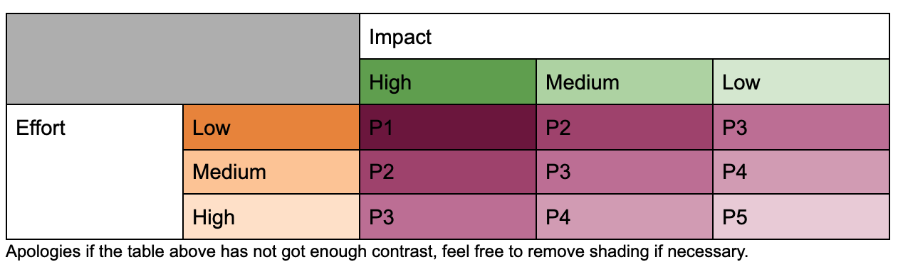

Contributing to 20% Backlog in DP
=================================

There are many ways in which the Trello 20% backlog board gets populated and then prioritised by the Technical Leads.

Below is how you can help to get your ideas and resolving bugbears you may have onto the 20% time board to fix or improve our way of working in development.

### Pre-reading

- It is useful to have an understanding of the [Trello board and flow of stories](./TRELLO_BOARD_FLOW.md) and how we use it to organise development workflow as it is mentioned in this documentation
- It is useful to have an understanding of [70%, 20% and 10% time](./70_20_10_TIME.md)

### How to get ideas onto the 20% Trello Board?

It is beneficial to yourself and others to bounce off ideas that you may think would help the development team before progressing an idea. This can really help develop an idea into something more tangible and allow a larger buy in from the wider team. It could also identify why this might not be a good idea, or there is not a problem to solve here, either way it is still encouraged to voice any ideas and not be disheartened by any push back, remember we are one team and consensus from the team is important.

- It is advisable to reach out to your peers to discuss any ideas, this can be done in any guilds you are part of.
- If unsure one can raise with a (S7) Senior Developer or Technical Lead.

Once you are confident in your idea/suggestion, you may add your story to [triage column in the 20% backlog board](https://trello.com/b/5G8rf9cm/20-time-backlog).

### What should be included in the 20% story?

Please remember that when a 20% story is triaged and looked at by others that they will need to be able to understand the story so they can clearly make a decision on the value of this story and prioritise it according to the existing backlog of 20% work.

One should use the relevant templates available on the trello board, these can be found in the column at the end of the board by scrolling right and are labelled with `This card is a template`.

To generate a new trello card from a predefined template, click on the template card. In the top right corner of the pop up is a blue button `Create card from template`, click this to generate a new card with this template structure.

New template cards can be created if there is a need to do so. To do this create a new trello card and style it accordingly. At the bottom right of the trello card is a list of `ACTIONS` and below this will be a `Template` button, click this to convert the card to a template one.

**Important things to consider when writing up the story:**

- The story should have a clear succinct title
- Adding the relevant labels on the story (Spike, Bug etc.)
- A clear description of the problem or suggested improvement
- Include what cost is this problem having on us and the value of doing this story?
    - Wasting development time
    - How much time is sunk into manually fixing/putting in hacks?
    - Running services when we don’t need them
- How much effort would be required to do this?
- Acceptance Criteria
    - What needs have to be met?

If possible:
- Attach to available epics (first column in trello board), including epic tag
- Attach relevant links to docs/pocs that may already exist
- Contain the services/libraries (repos) that are affected 

### When and how will Technical Leads prioritize which stories get picked up first?

Tech leads have a regular 20% time triage and prioritization meeting, so new stories should be getting checked every 2-4 weeks and prioritized against existing stories.

Prioritising stories should be based on the value of getting something done for the benefit of the development team. The proposed values are the amount of effort required to complete a story and the impact it has on the development team.

Using an impact and effort matrix to decide priority order, these two properties should enable us to decide what stories should be done first as they should indicate what value we will get by doing them.

Where P1 stories are a higher priority then P2, which are higher than P3 and so on.
