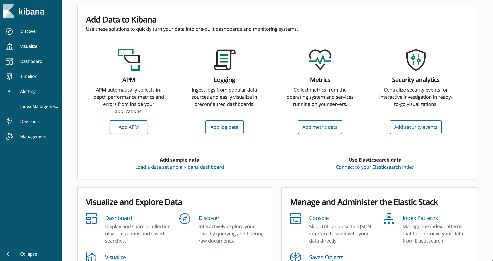
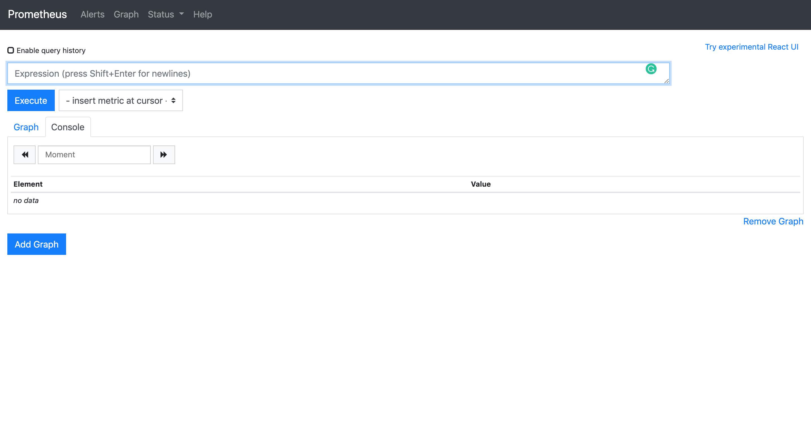
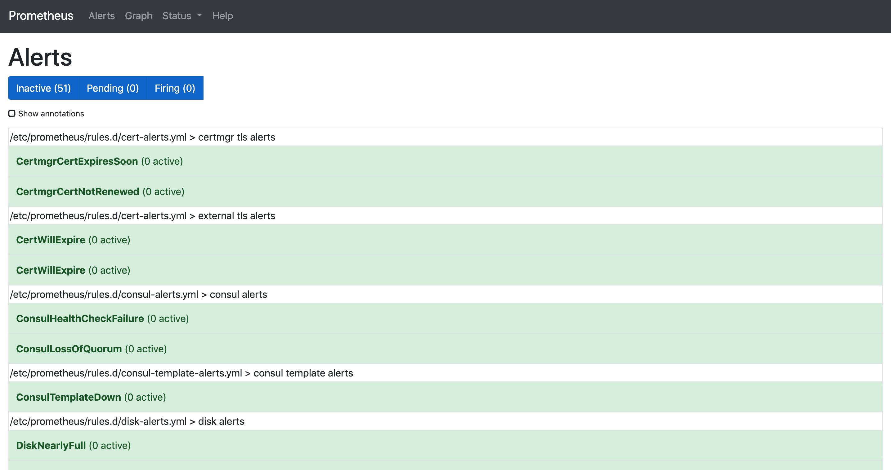

Monitoring and Alerting
===========================

## Kibana

Visit the following to access Kibana

- SANDBOX:&nbsp;&nbsp;<https://kibana.dp.aws.onsdigital.uk/>
- STAGING:&nbsp;&nbsp;<https://kibana.dp-staging.aws.onsdigital.uk/>
- PROD:&nbsp;&nbsp;&nbsp;&nbsp;&nbsp;&nbsp;&nbsp;&nbsp;<https://kibana.dp-prod.aws.onsdigital.uk>

[][kibana-dev-home] [][kibana-dev-home]

Kibana provides the ability to query and filter aggregated messages from all apps, which is possible through the mechanisms set in place to capture all app logs and other indexes/responsibilities such as networking and system processes, and forwarding them to a shared elasticsearch instance. The use of logs in Kibana assists in debugging. We can filter the namespace to check logs of a specific application and filter with other properties to find information more quickly.

To filter the logs by namespace, follow the steps below:

1. Access kibana for the required environment (e.g. sandbox)
2. Click on the button which has three lines on it on the left
3. Click on "discover"
4. Click on "Add filter" link on the left
5. In the "field" textbox that appears in the popup, type "namespace" and select the value that is returned
6. Select the "is" value from the operator drop down list
7. Type the name of the service that logs are to be queried for in the "Value" textbox (e.g. `dp-dataset-api`) and press return
8. The logs for the service should now be returned.

Logs can be queried either by adding more filters or by using the search query bar - more information on creating queries can be found here - <https://www.elastic.co/guide/en/kibana/current/kuery-query.html>.  

More information about Kibana can be found on their website - <https://www.elastic.co/kibana>

## Grafana

Visit the following to access Grafana

- SANDBOX:&nbsp;&nbsp;<https://grafana.dp.aws.onsdigital.uk/>
- STAGING:&nbsp;&nbsp;<https://grafana.dp-staging.aws.onsdigital.uk/>
- PROD:&nbsp;&nbsp;&nbsp;&nbsp;&nbsp;&nbsp;&nbsp;&nbsp;<https://grafana.dp-prod.aws.onsdigital.uk>

[][grafana-dev-home] [][grafana-dev-nomad-tasks]

Grafana informs how a process is behaving on the machine (its use of CPU, memory, use of IO operations, etc). In Grafana, the [Nomad Task][grafana-dev-nomad-tasks] dashboard is commonly used, which gives a list of tasks (each related to a specific application). From there, you can see the behaviours of specific applications to the machine such as memory usage (e.g. to identify a potential memory leak by changing the range of time to 7 days and analysing the graph). Grafana assists in debugging and we can look at [Kibana](#kibana) to see logs at a particular time based on any anomalies discovered from graphs in Grafana. Furthermore, the [Node Stats 2][grafana-dev-node-stats-2] dashboard is used as well which is specific to EC2 instances performance.

Please note that CPU can exceed its defined limits (known as bursting), as they are 'soft limits'. On the other hand, memory has a 'hard limit' and any use in excess will cause the service to stop/restart.

More information about Grafana can be found on their website - <https://grafana.com/docs/grafana/latest/>

## Prometheus

Visit the following to access Prometheus

- SANDBOX:&nbsp;&nbsp;<https://prometheus.dp.aws.onsdigital.uk/>
- STAGING:&nbsp;&nbsp;<https://prometheus.dp-staging.aws.onsdigital.uk/>
- PROD:&nbsp;&nbsp;&nbsp;&nbsp;&nbsp;&nbsp;&nbsp;&nbsp;<https://prometheus.dp-prod.aws.onsdigital.uk>

[][prometheus-dev-home] [][prometheus-dev-alerts]

Prometheus provides alerts and alarms to notify us on technical issues. These alerts set in Prometheus trigger alarm messages in Slack.
Prometheus stores all data as a time series, and monitors for changes over time. The information can be viewed in Prometheus as a chart, and these charts are linked to the alerts so more detail is available to investigate on the alert. Prometheus uses the flexible query language [PromQL][prometheus-querying] to let us select and aggregate time series data in real time, speeding up the process of debugging.

More information about Prometheus can be found on their website - <https://prometheus.io/docs/introduction/overview/>

[//]: # (Reference Links and Images)
[kibana-dev-home]: <https://kibana.dp.aws.onsdigital.uk>
[grafana-dev-home]: <https://grafana.dp.aws.onsdigital.uk>
[grafana-dev-nomad-tasks]: <https://grafana.dp.aws.onsdigital.uk/d/000000014/nomad-task?refresh=10s&orgId=1>
[grafana-dev-node-stats-2]: <https://grafana.dp.aws.onsdigital.uk/d/000000004/node-stats-2?refresh=10s&orgId=1>
[prometheus-dev-home]: <https://prometheus.dp.aws.onsdigital.uk>
[prometheus-dev-alerts]: <https://prometheus.dp.aws.onsdigital.uk/alerts>
[prometheus-querying]: <https://prometheus.io/docs/prometheus/latest/querying/basics>