Platform Services
===========================

Platform services allow us to develop, run, and manage applications without the complexity of building and maintaining the infrastructure typically associated with developing and launching an app. This documentation gives information on the platform services that we use to assist in deploying and monitoring applications.

## Pre requisites

You need to complete the [set up your Mac for development work][setup-ons-mac]. If this has not been completed, please click on the link and follow the instructions. Afterwards, return back to this page.

Run `dp remote allow develop` and `dp remote allow concourse` to ensure you can access concourse and the develop environment.
Please note that if you have production access, you can run `dp remote allow production` to access production environment.

[Cloud Technologies and Infrastructure](../services/INFRASTRUCTURE.md) - You should have an understanding of AWS and the infrastructure as the platform services are very closely related to this

## Structure

## Contents
 - [Terraform](#terraform)
 - [Ansible](#ansible)
 - [Concourse](#concourse)
 - [Consul](#consul)
 - [Nomad](#nomad)
 - [Kibana](#kibana)
 - [Vault](#vault)
 - [Grafana](#grafana)
 - [Prometheus](#prometheus)

## Terraform
> Terraform is an open-source infrastructure as code software tool that provides a consistent CLI workflow to manage hundreds of cloud services. Terraform codifies cloud APIs into declarative configuration files. It allows infrastructure to be expressed as code in a simple, human readable language called HCL (HashiCorp Configuration Language). It reads configuration files and provides an execution plan of changes, which can be reviewed for safety and then applied and provisioned.

Terraform provisioning builds the infrastructure for the test and live environments (`develop` and `production`) which involves setting up stacks (`app-users`, `web`, `publishing`, `mongodb`, etc). Therefore, whenever an infrastructure change is required, terraform needs to be run. The use of terraform is located in [dp-setup/terraform][dp-setup-terraform]
 
More information about Terraform can be found on their website - https://www.terraform.io/

## Ansible
> Ansible is an open-source software provisioning, configuration management, and application-deployment tool enabling infrastructure as code. It uses no agents and no additional custom security infrastructure, so it's easy to deploy and uses YAML, in the form of Ansible Playbooks, that allows to describe the automation jobs. 

Ansible provisioning can be considered as adding and configuring applications *to* the test and production service environments in the cloud (`develop` and `production`). Therefore, whenever the change of the infrastructure *of the app* is required, ansible needs to be run. The use of ansible is located in [dp-setup/ansible][dp-setup-ansible]

More information about Ansible can be found on their website - https://www.ansible.com/overview/how-ansible-works

## Concourse
Visit https://concourse.onsdigital.co.uk to access Concourse

[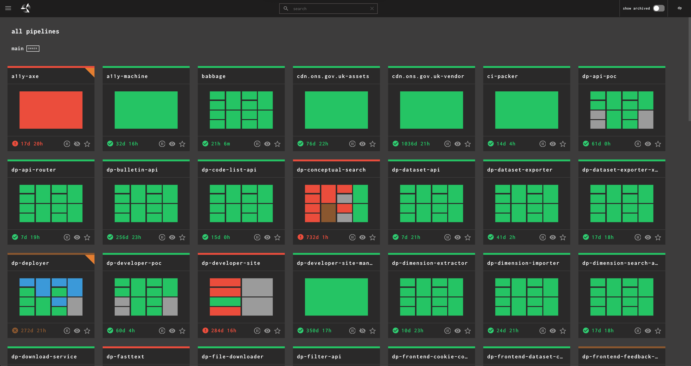][concourse-ons] [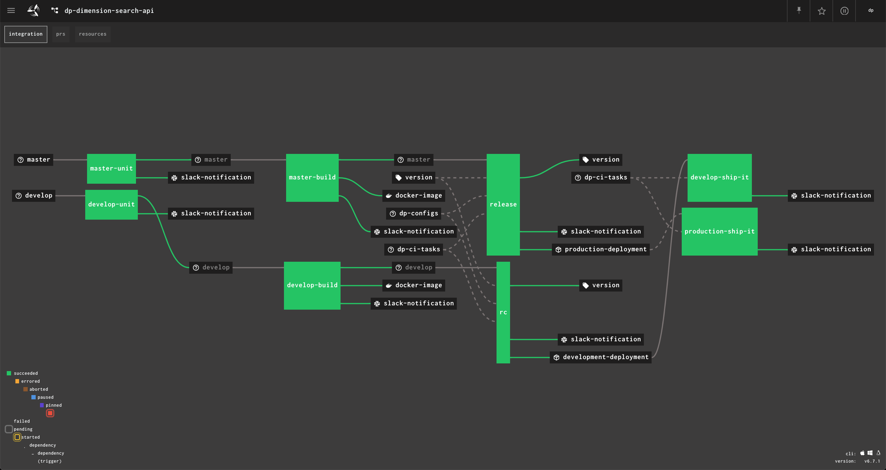][concourse-ons]

Concourse lists all of the applications where each application has its own [pipeline][concourse-pipeline]. 
When a [PR][git-pr] of a application is said to be merged into `develop` or `master`, Concourse runs the pipeline of the application which does unit testing, checks if a [docker image][docker-image] can be build for it, bundles it for release and ships it to that release whilst ensuring that it has deployed everything completely.

Furthermore, Concourse helps us to identify if an application has been fully deployed with any new changes implemented and can provide information on the version of the application which is currently running in the `develop` and `production` environments. 

Please note that when deploying changes to the `production` environment (the live website), you need to **manually** deploy the application by doing the following:
1. Go to [Concourse][concourse-ons]
2. Navigate to the application
3. Click on `production-ship-it`
4. 
Click on the 

5. Login to concourse as `dp` user (if you do not have the login, please ask anyone in the team)

More information about Concourse can be found on their website - https://concourse-ci.org/docs.html 

## Consul
Visit the following to access Consul
- DEVELOP:&nbsp;&nbsp;&nbsp;&nbsp;&nbsp;&nbsp;&nbsp;&nbsp;&nbsp;&nbsp;&nbsp;https://consul.develop.onsdigital.co.uk
- PRODUCTION:&nbsp;&nbsp;&nbsp;https://consul.production.onsdigital.co.uk

[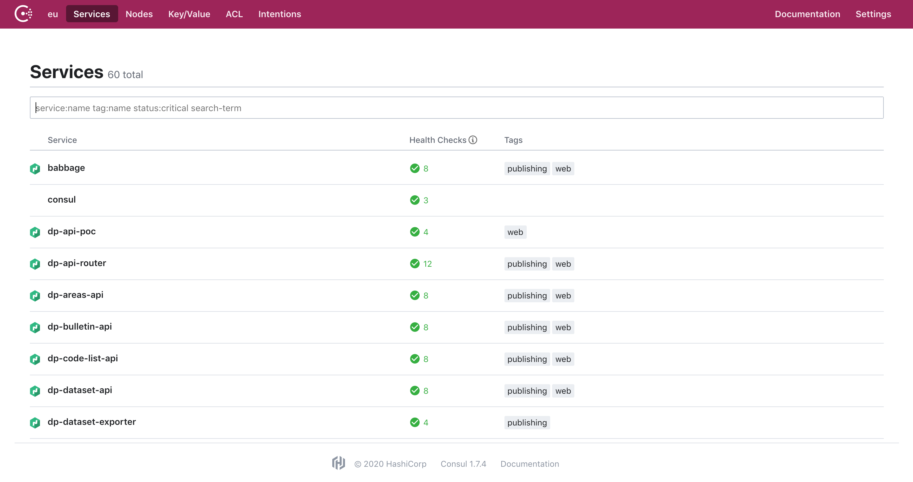][consul-dev-services]

> Consul is a service mesh solution providing a full featured control plane with service discovery, configuration, and segmentation functionality. Each of these features can be used individually as needed, or they can be used together to build a full service mesh

Consul is mainly used to check the health of applications which Consul retrieves by calling the health check endpoints of the application (`/health`). This information is then used to monitor cluster health, and it is used by the service discovery components to route traffic away from unhealthy hosts

More information about Consul can be found on their website - https://www.consul.io/docs/intro

## Nomad
Visit the following to access Nomad
- DEVELOP:&nbsp;&nbsp;&nbsp;&nbsp;&nbsp;&nbsp;&nbsp;&nbsp;&nbsp;&nbsp;&nbsp;https://nomad.develop.onsdigital.co.uk
- PRODUCTION:&nbsp;&nbsp;&nbsp;https://nomad.production.onsdigital.co.uk

[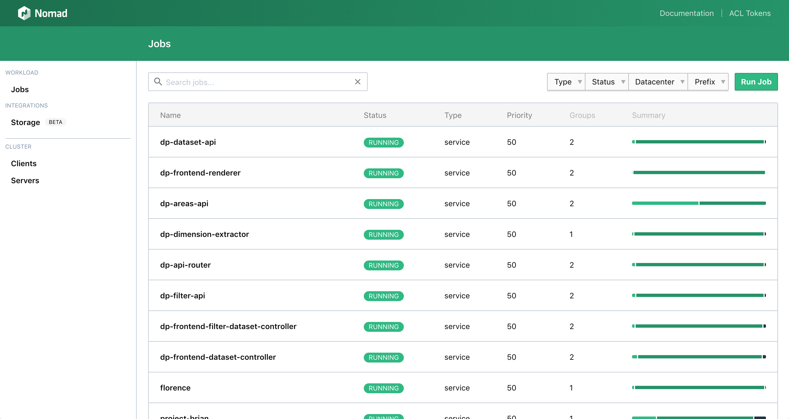][nomad-dev-home] [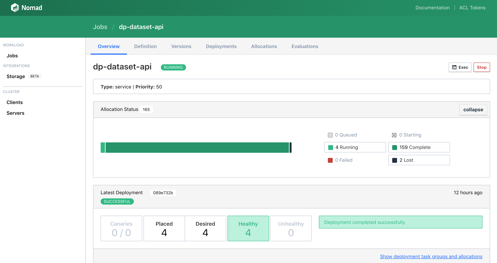][nomad-dev-home]

> Nomad is a simple and flexible workload orchestrator to deploy and manage containers and non-containerized applications across on-prem and clouds at scale

Nomad enables us to deploy our applications by bundling computing resources of [AWS][AWS]. In Nomad, each application is considered as a [job][nomad-job] which can have multiple [task groups][nomad-task-group] (`web` or `publishing`). The mapping of these tasks in a job is done using allocations, which is used to declare that a set of tasks in a job should be run on a particular node. Nomad would schedule these allocations which is detailed more [here][nomad-scheduling].   

With Nomad, we can understand whether a particular allocation or the entire service itself is failing. We can look at a specific task depending on the journey (e.g. looking at the publishing task group of the application if the publishing journey was carried out). We can check the logs for specific allocations for debugging. Another common use of Nomad is to stop and start a service (do not do this in production) to capture new updates and secrets for the application. 

More information about Nomad can be found on their website - https://www.nomadproject.io/

## Kibana
Visit the following to access Kibana
- DEVELOP:&nbsp;&nbsp;&nbsp;&nbsp;&nbsp;&nbsp;&nbsp;&nbsp;&nbsp;&nbsp;&nbsp;https://kibana.develop.onsdigital.co.uk
- PRODUCTION:&nbsp;&nbsp;&nbsp;https://kibana.production.onsdigital.co.uk

[][kibana-dev-home] [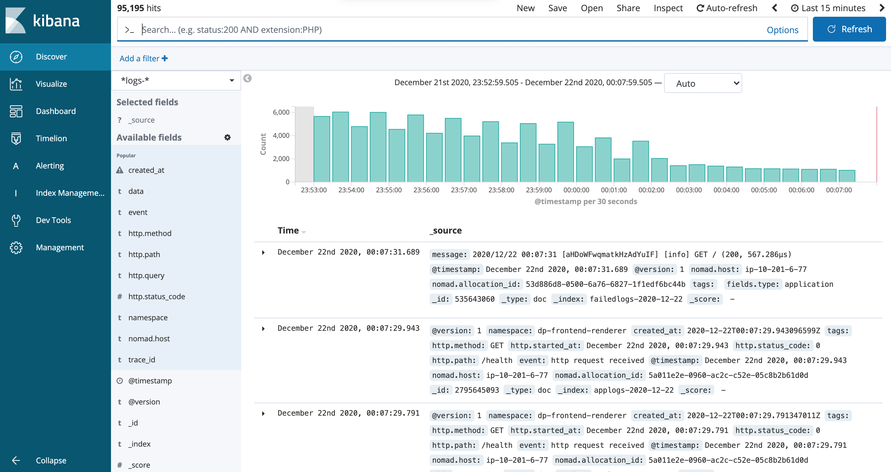][kibana-dev-home]

Kibana provides log aggeration where all logs are pushed to Kibana, allowing us to check the logs of all applications. With the use of logs in Kibana, this assists in debugging. We can filter the namespace to check logs of a specific application and filter with other properties to find information more quickly 

More information about Kibana can be found on their website - https://www.elastic.co/kibana

## Vault
Visit the following to access Vault
- DEVELOP:&nbsp;&nbsp;&nbsp;&nbsp;&nbsp;&nbsp;&nbsp;&nbsp;&nbsp;&nbsp;&nbsp;https://vault.develop.onsdigital.co.uk
- PRODUCTION:&nbsp;&nbsp;&nbsp;https://vault.production.onsdigital.co.uk

**To sign into Vault, you require a `token` which can be retrieved from the [helper script in dp-setup][helper-script-dp-setup]**

[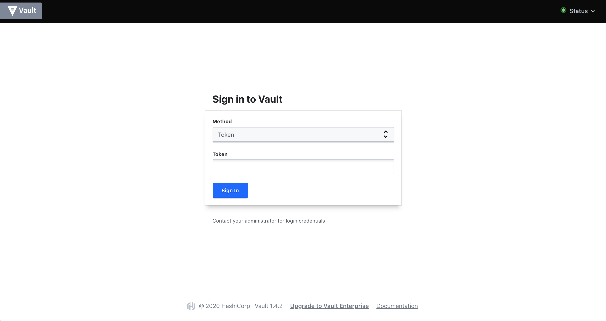][vault-develop] [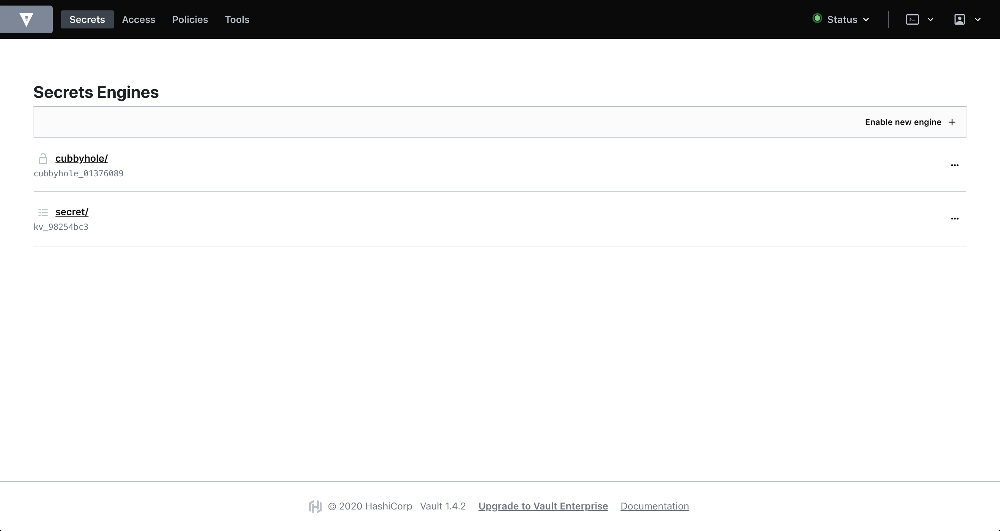][vault-develop]

> Vault secures, stores and tightly controls access to tokens, passwords, certificates, encryption keys for protecting secrets and other sensitive data

Vault manage secrets and stores the secrets in [dp-configs][dp-configs-secrets] in a secure way and made available to the service (which can turn feature on and off). In general, Vault is used for the following two functionalities:
1. Storing application configs (secrets) from [dp-configs][dp-configs-secrets]
2. Storing per-file encryption keys for CMD uploads, image uploads, etc. 
   
Some apps that deal with S3 uploads (florence, dataset exporter etc) need a vault client in the app and hence this is informed in their Makefile) while other apps only retrieve configs. Please note that all apps need their [vault policies][vault-policy] defined in [dp-setup/ansible/files/vault-policies][dp-setup-vault-policies]. Policies provide a declarative way to grant or forbid access to certain paths and operations in Vault. That’s why if you look at the vault policies, most will only have one path while some (such as [florence vault policy][florence-vault-policy] which deals with S3 uploads) will have multiple.

More information about Vault can be found on their website - https://www.vaultproject.io/

## Grafana
Visit the following to access Grafana
- DEVELOP:&nbsp;&nbsp;&nbsp;&nbsp;&nbsp;&nbsp;&nbsp;&nbsp;&nbsp;&nbsp;&nbsp;https://grafana.develop.onsdigital.co.uk
- PRODUCTION:&nbsp;&nbsp;&nbsp;https://grafana.production.onsdigital.co.uk

[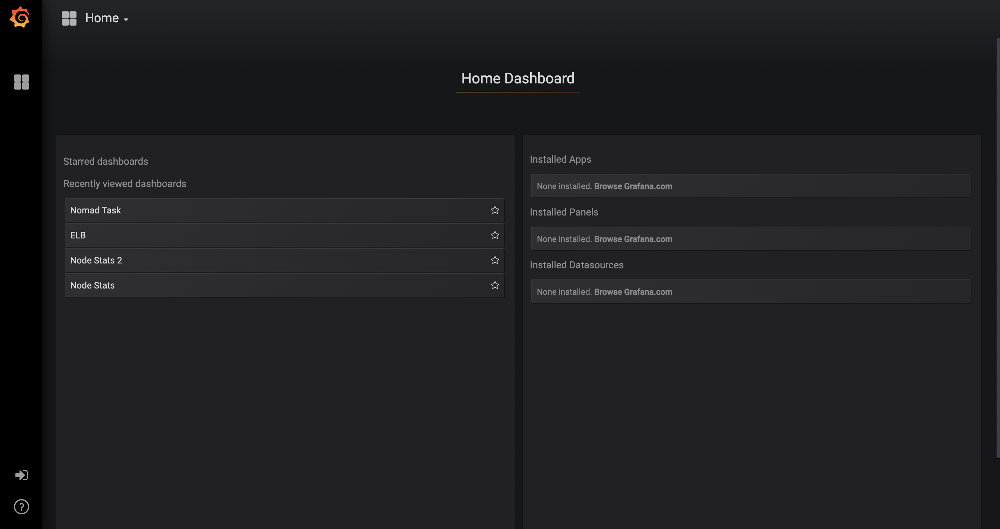][grafana-dev-home] [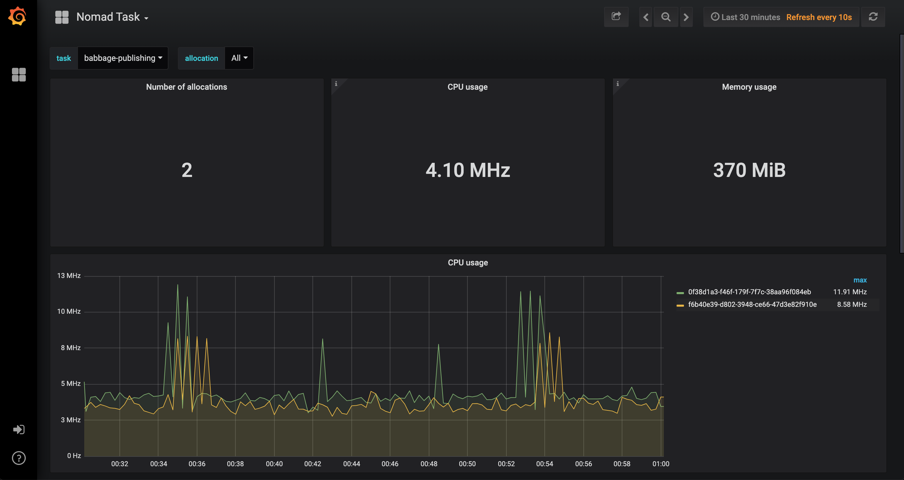][grafana-dev-nomad-tasks]

Grafana informs how a process is behaving on the machine (its use of CPU, memory, use of IO operations, etc). In Grafana, the [Nomad Task][grafana-dev-nomad-tasks] dashboard is commonly used, which gives a list of tasks (each related to a specific application). From there, you can see the behaviours of specific applications to the machine such as memory usage (e.g. to identify a potential memory leak by changing the range of time to 7 days and analysing the graph). Grafana assists in debugging and we can look at [Kibana](#kibana) to see logs at a particular time based on any anomalies discovered from graphs in Grafana. Furthermore, the [Node Stats 2][grafana-dev-node-stats-2] dashboard is used as well which is specific to EC2 instances performance.

Please note that CPU can spike as reserved CPU can exceed the limit because of its soft limit (CPU bursting). On the other hand, memory usage cannot spike as a hard limit is set for reserved memory and if memory exceeds its limit, the service will stop and restart

More information about Grafana can be found on their website - https://grafana.com/docs/grafana/latest/

## Prometheus
Visit the following to access Prometheus
- DEVELOP:&nbsp;&nbsp;&nbsp;&nbsp;&nbsp;&nbsp;&nbsp;&nbsp;&nbsp;&nbsp;&nbsp;https://prometheus.develop.onsdigital.co.uk
- PRODUCTION:&nbsp;&nbsp;&nbsp;https://prometheus.production.onsdigital.co.uk

[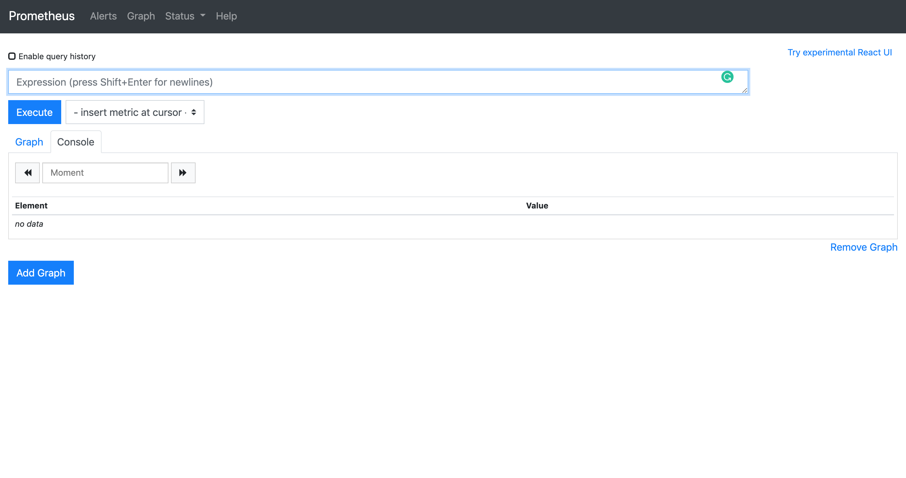][prometheus-dev-home] [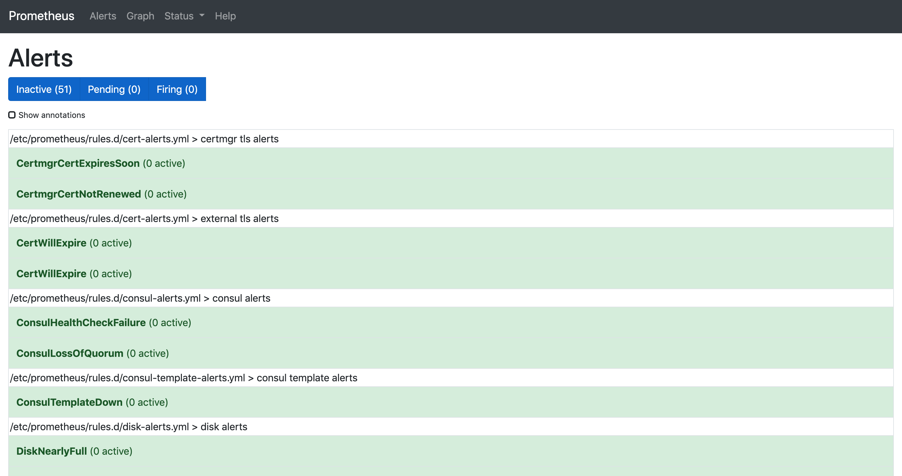][prometheus-dev-alerts]

Prometheus provides alerts and alarms to notify us on technical issues. These alerts set in Prometheus is alarmed in Slack. Prometheus stores all data as time series in which a time series graph can be viewed to report information. Therefore, more details about the alert can be retrieved from Prometheus. Prometheus uses the flexible query language [PromQL][prometheus-querying] to let us select and aggregate time series data in real time, speeding up the process of debugging

More information about Prometheus can be found on their website - https://prometheus.io/docs/introduction/overview/

## Next steps

1. Gain experience and familiarity with the platform services
2. Please update this file if important information are missing regarding the platform services

Further resources
----------------------------
1. Attend the [`Support 101 - Platform issues`][support-101-slides] workshop which gives more detail about the platform services and in particular, issues related to the services

[//]: # (Reference Links and Images)

   [setup-ons-mac]: <https://github.com/ONSdigital/dp/blob/master/guides/GETTING_STARTED.md#set-up-your-mac-for-development-work>
   [dp-setup-terraform]: <https://github.com/ONSdigital/dp-setup/tree/develop/terraform>
   [dp-setup-ansible]: <https://github.com/ONSdigital/dp-setup/tree/develop/ansible>
   [concourse-ons]: <https://concourse.onsdigital.co.uk>
   [git-pr]: <https://docs.github.com/en/free-pro-team@latest/github/collaborating-with-issues-and-pull-requests/about-pull-requests#:~:text=Pull%20requests%20let%20you%20tell,merged%20into%20the%20base%20branch.>
   [concourse-pipeline]: <https://concourse-ci.org/pipelines.html#pipelines>
   [docker-image]: <https://jfrog.com/knowledge-base/a-beginners-guide-to-understanding-and-building-docker-images/>
   [consul-dev-services]: <https://consul.develop.onsdigital.co.uk/ui/eu/services>
   [consul-dev-nodes]: <https://consul.develop.onsdigital.co.uk/ui/eu/nodes>
   [nomad-dev-home]: <https://nomad.develop.onsdigital.co.uk>
   [AWS]: <https://aws.amazon.com/>
   [nomad-job]: <https://learn.hashicorp.com/tutorials/nomad/get-started-jobs>
   [nomad-task-group]: <https://www.nomadproject.io/docs/job-specification>
   [nomad-scheduling]: <https://www.nomadproject.io/docs/internals/scheduling/scheduling>
   [kibana-dev-home]: <https://kibana.develop.onsdigital.co.uk>
   [helper-script-dp-setup]: <https://github.com/ONSdigital/dp-setup/tree/develop/scripts>
   [dp-configs-secrets]: <https://github.com/ONSdigital/dp-configs/tree/master/secrets>
   [dp-setup-vault-policies]: <https://github.com/ONSdigital/dp-setup/tree/develop/ansible/files/vault-policies>
   [vault-policy]: <https://www.vaultproject.io/docs/concepts/policies>
   [florence-vault-policy]: <https://github.com/ONSdigital/dp-setup/blob/develop/ansible/files/vault-policies/florence.hcl>
   [vault-develop]: <https://vault.develop.onsdigital.co.uk>
   [grafana-dev-home]: <https://grafana.develop.onsdigital.co.uk>
   [grafana-dev-nomad-tasks]: <https://grafana.develop.onsdigital.co.uk/d/000000014/nomad-task?refresh=10s&orgId=1>
   [grafana-dev-node-stats-2]: <https://grafana.develop.onsdigital.co.uk/d/000000004/node-stats-2?refresh=10s&orgId=1>
   [prometheus-dev-home]: <https://prometheus.develop.onsdigital.co.uk>
   [prometheus-dev-alerts]: <https://prometheus.develop.onsdigital.co.uk/alerts>
   [prometheus-querying]: <https://prometheus.io/docs/prometheus/latest/querying/basics>
   [support-101-slides]: <https://docs.google.com/presentation/d/1AHUouPbIbOwFzAVRnfVIJNLifxZm512kHJZBe5X5BwM/edit#slide=id.ga77d8de13d_0_161>